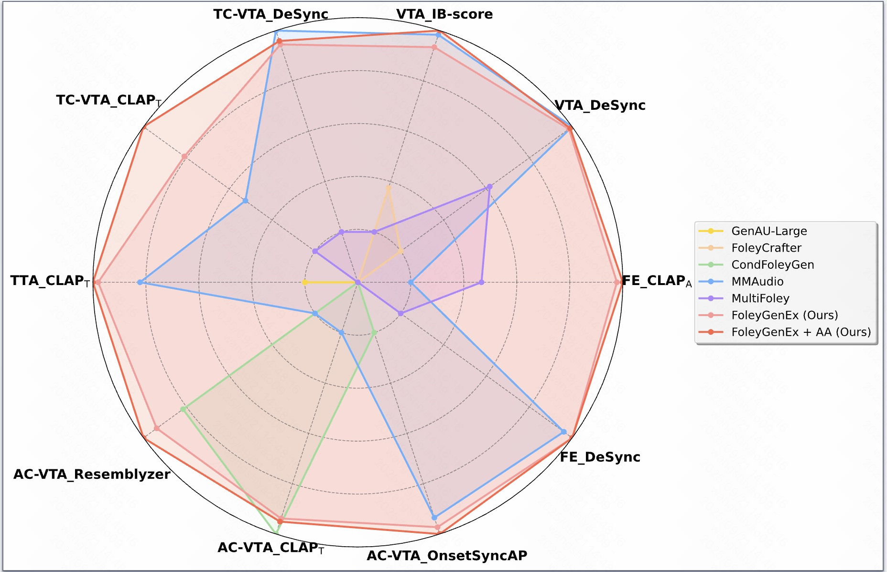
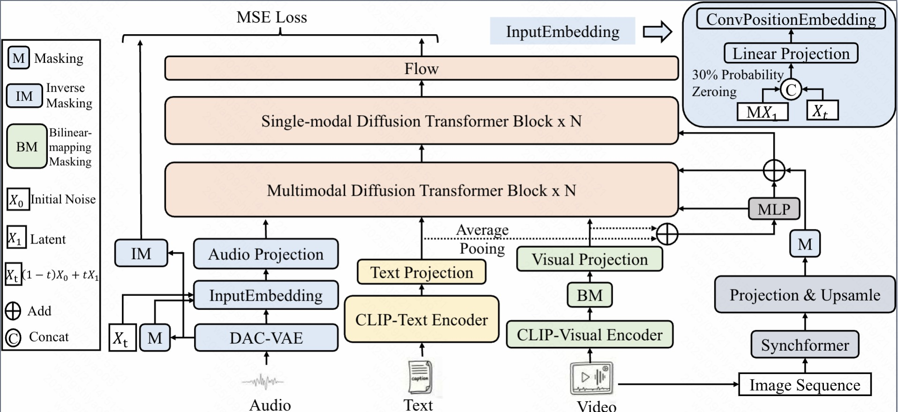
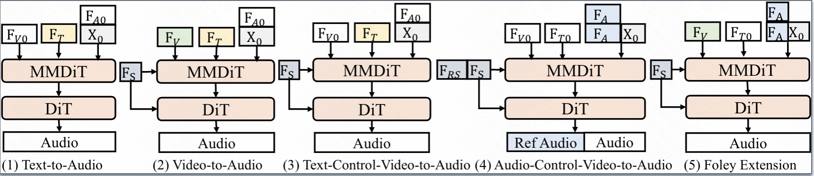
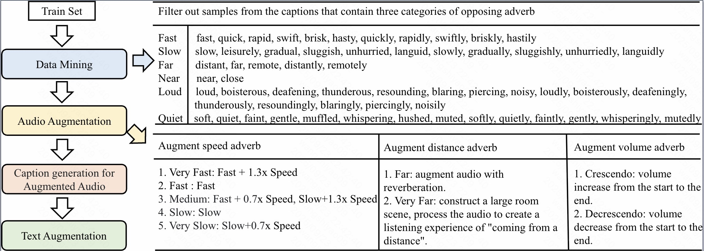

<h1 align="center">FoleyGenEx: Unified Video-to-Audio Generation with Multi-Modal Control, Temporal Alignment, and Semantic Precision</h1>

  

  <strong>
    

      Figure 1: FoleyGenEx supports a range of multi-modal controlled audio generation tasks, including Text-to-Audio (TTA), basic Video-to-Audio (VTA), Text-Controlled VTA (TC-VTA), Audio-Controlled VTA (AC-VTA), and Foley extension (FE). It unifies these tasks while achieving strong synchronization, versatile control, and expressive audio generation.
    

  </strong>

  

  <strong>
    

      Figure 2: FoleyGenEx training framework.
    

  </strong>

  

  <strong>
    

      Figure 3: Multi-modal controlled audio generation tasks.
    

  </strong>

  

  <strong>
    

      Figure 4: Adverb-based data augmentation algorithm.
    

  </strong>

##  Abstract 📖
We introduce FoleyGenEx, a unified framework for video-to-audio (VTA) generation that integrates multi-modal control, frame-level temporal alignment, and fine-grained semantic expressivity, enabling synchronized, versatile, and expressive audio synthesis across diverse tasks. Existing VTA methods either offer multi-modal control with weak temporal alignment or achieve strong alignment while lacking reference audio conditioning and semantic precision. FoleyGenEx bridges this gap through three key innovations: a conditional injection mechanism enabling audio-controlled VTA and Foley extension, a multi-modal dynamic masking strategy preserving synchronization during multi-modal training, and an adverb-based data augmentation algorithm leveraging signal processing and large language models to enrich audio representations and textual supervision with nuanced semantic cues. Experiments on AudioCaps, VGGSound, and Greatest Hits show that FoleyGenEx delivers competitive performance in controllable VTA generation, achieving strong temporal fidelity, versatile multi-modal control, and fine-grained semantic precision compared to existing methods.
