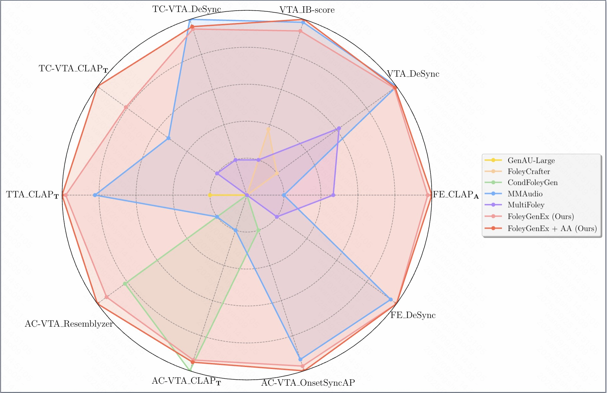
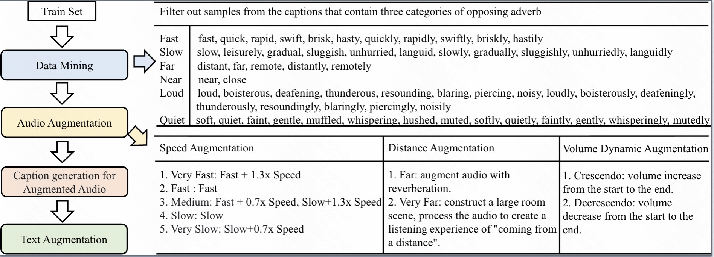

<h1 align="center">FoleyGenEx: Unified Video-to-Audio Generation with Multi-Modal Control, Temporal Alignment, and Semantic Precision</h1>

  

  <strong>
    

      Figure 1: FoleyGenEx supports a range of multi-modal controlled audio generation tasks, including Text-to-Audio (TTA), basic Video-to-Audio (VTA), Text-Controlled VTA (TC-VTA), Audio-Controlled VTA (AC-VTA), and Foley extension (FE). It unifies these tasks while achieving strong synchronization, versatile control, and expressive audio generation.
    

  </strong>

  

  <strong>
    

      Figure 2: FoleyGenEx training framework.
    

  </strong>

  

  <strong>
    

      Figure 3: Multi-modal controlled audio generation tasks.
    

  </strong>

  

  <strong>
    

      Figure 4: Adverb-based data augmentation algorithm.
    

  </strong>

##  Abstract 📖
We introduce FoleyGenEx, a unified framework for video-to-audio (VTA) generation that combines multi-modal control, precise frame-level temporal alignment, and fine-grained semantic precision. This enables synchronized, versatile, and expressive audio synthesis for diverse tasks. Current VTA methods either lack strong temporal alignment despite supporting multi-modal control (e.g., MultiFoley), or achieve strong temporal alignment but lack reference audio conditioning and fine-grained semantic expressivity (e.g., MMAudio). FoleyGenEx bridges this gap with three key innovations: a conditional injection mechanism for audio-controlled VTA and Foley extension, a multi-modal dynamic masking strategy that preserves synchronization during multi-modal training, and an adverb-based data augmentation algorithm leveraging signal processing and large language models to enrich audio representations and textual supervision with nuanced semantic cues. Extensive experiments on AudioCaps, VGGSound, and Greatest Hits demonstrate that FoleyGenEx inherits MMAudio's temporal fidelity, extends MultiFoley's multi-modal control, and uniquely supports fine-grained adverb-level control, setting a new state of the art for controllable video-to-audio generation.
